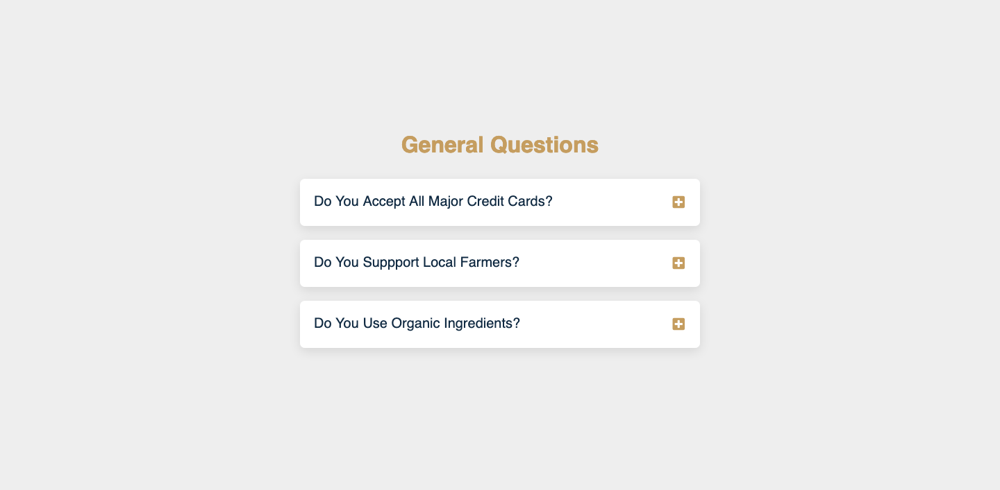

# How to create a FAQ page
## Created With Html, Css, Js
In this Project, i learned from [freecodecamp](https://www.freecodecamp.org/news/javascript-projects-for-beginners/#how-to-create-a-faq-page) how to create a frequently asked questions page.

## Screenshot

## Key concepts covered:
- document.querySelectorAll()
- addEventListener()
- forEach()
- classList.remove()
- classList.toggle()
